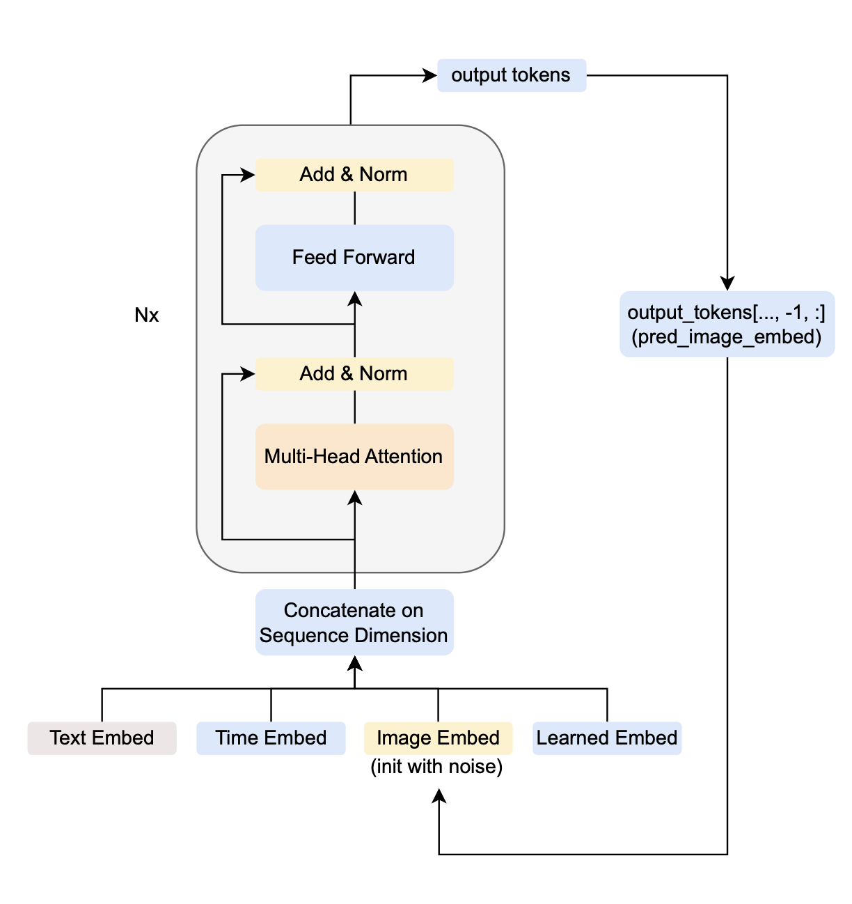
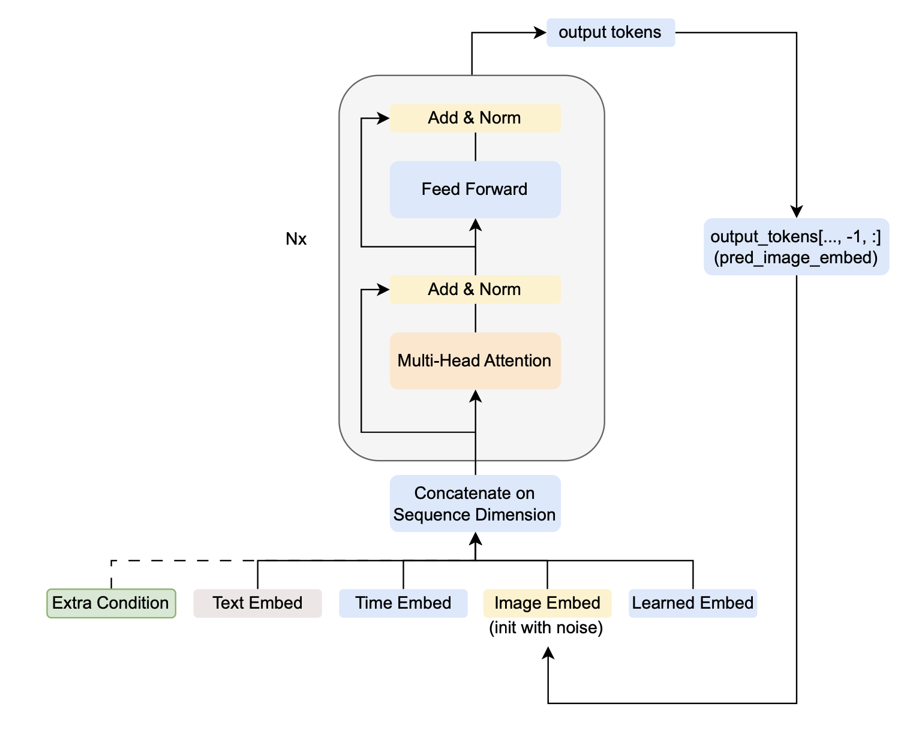

# Diffusion-Prior

This repository is a streamlined version of the `dalle2-pytorch` repository, retaining only the Prior model while removing components related to the Unet and decoder.

## What is a Prior Model?

Introduced in OpenAI's DALLE-2 paper, a Prior model is a network that converts text embeddings to image embeddings. Specifically, it correlates CLIP text embeddings with CLIP image embeddings.

## Why Do We Need a Prior Model?

In typical diffusion-based text-to-image generation pipelines, text information guides the image generation process. This is usually achieved by using a text encoder and injecting the text embeddings into the Unet for guidance, ensuring the image output follows the instructions from the text (a task referred to as text alignment). While pioneering work has utilized CLIP text embeddings, CLIP text embeddings and CLIP image embeddings exist in different spaces. Research has shown that image embeddings encode better semantics and thus serve as superior conditions in conditional text-to-image generation tasks.

This motivates the creation of a module that can convert CLIP text embeddings to CLIP image embeddings. During inference, the pipeline involves obtaining the CLIP text embedding from the original prompt, then using the Prior model to convert it into a CLIP image embedding. The CLIP image embedding is then used as a condition in generating the image using diffusion models, provided the model was trained with CLIP image embeddings.

## The Architecture of the Prior Model

At a high level, a Prior model is a diffusion model implemented alongside a transformer. The input has dimensions [batch, seq_length, 1024], and the output has dimensions [batch, 1, 1024]. The structure can be represented as follows:

<div style="text-align: center;">
    
</div>


Let's run through an example of one forward pass. Suppose we have text embeddings from CLIP, with a maximum length of 77 tokens. The text embedding tensor has a shape of [batch_size, 77, 1024]. The time embedding, image embedding (starting with Gaussian noise), and learned embedding all have shapes of [batch_size, 1, 1024]. By concatenating them along the sequence length dimension, we get a tensor of shape [batch_size, 80, 1024] as input to the transformer. The transformer's output is also a tensor of shape [batch_size, 80, 1024], and we select the last token (corresponding to the special learned embedding) as the prediction for the image embedding. This explains one step of the diffusion process, which is repeated for a fixed number of steps.

(Note: This process explains how to obtain the CLIP image embedding from the CLIP text embedding. To obtain an image from the CLIP image embedding, one needs a decoder or a type of diffusion model that was trained with the CLIP image embedding as a condition.)

## Important Files Overview

Below is a brief description of some important files in the original repository, providing an introduction and an easy entry point.

### Training Entry Point:

**`train_diffusion_prior.py`**

This file serves as the entry point for training the diffusion prior model. It supports distributed training via the `accelerate` library and includes key functionalities such as model setup, tracker initialization, data loading, and the training loop. The script manages the training process, including backpropagation, gradient updates, and exponential moving average (EMA) updates. It periodically evaluates the model, computes validation loss, and measures cosine similarity between embeddings.

### Diffusion Prior Model Details:

**`dalle2-pytorch/dalle2-pytorch.py`**

This file defines the essential components for constructing a diffusion prior model. Specifically, the two classes `DiffusionPriorNetwork` and `DiffusionPrior` might seem confusing, so here are some key differences:

#### • DiffusionPriorNetwork

This class defines the transformer network shown in the diagram. In its forward function, it takes the input tokens and outputs the predicted image embedding. Note that this is a one-time forward pass and does not involve anything related to diffusion.

#### • DiffusionPrior

This class defines the entire diffusion process. In its initialization, a `DiffusionPriorNetwork` object is required. In this class, the forward function is responsible for computing the forward pass and the loss. This encapsulates the entire process of adding noise to the image embeddings, predicting the output, and calculating the loss based on the predictions. While this setup is uncommon, it can streamline certain parts of the training process, especially when the forward pass and loss computation are closely related and need to share intermediate computations or states.

Also, note that this style, where the forward function returns the loss, is reflected in the `train_diffusion_prior` file. In the training loop, the line `loss = trainer(text=txt, image_embed=img)` shows that the `trainer` object, an instance of `DiffusionPriorTrainer`, calls its forward function with the batch data and computes the loss directly inside this function.

## Example Usage

### Training

To train the diffusion prior model, run the following command:

```
accelerate launch train_diffusion_prior.py --config_file configs/train_prior_config.example.json
```

### Inference

To use the trained model for inference, you can follow this example code snippet:

```
TODO
```

## Advanced Capabilities of a Prior Model

### Adding Additional Attributes as Conditions

Given the transformer's nature, we can easily add other conditions to the prior model. For instance, as shown in the diagram below, we can prepend an extra token embedding representing an additional feature of the image, such as an aesthetic score, crowd description, or number of people. This requires a simple layer to convert the numerical value of the description to the proper token size [batch_size, 1, 1024].

<div style="text-align: center;">
    
</div>


### Connecting More Powerful Text Embeddings to Image Embeddings

Research has shown that more powerful text embeddings are needed to achieve better text alignment. Studies have demonstrated that diffusion models conditioned on advanced text encoders, like T5, perform better. It would be interesting to see if we can develop a prior model that correlates T5 text embeddings with CLIP image embeddings. Since conditioning on image embeddings is intuitively better than conditioning only on text embeddings, this approach holds potential. However, a potential issue is that CLIP image embeddings might not be powerful enough, acting as a bottleneck in providing accurate instructions to the diffusion models. This doesn't mean the prior model is a dead end; it indicates that modifications are possible by replacing CLIP image embeddings with more advanced image embedding models.
